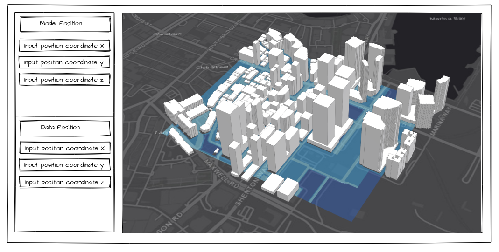

## Cooling Singapore 2.0

### Frontend Developer Test
You are tasked to develop a web application to align a 3D geometry with a colored map. The application should contain two parts. Part 1 involves a data visualisation component that displays a 3D geometry and a map. Part 2 is concerned with a control panel that allows its users to input `x`, `y`, `z` coordinates for the 3D geometry and the map. The visualisation component should automatically update the position of the geometry or the map every time a user changes any on of the coordinates. Users should be able to keep modifying the position of the two elements until they are aligned with each other.

You can consider a solution that visualization objects can be moved by mouse, but the coordinates on the side panel should be updated when the object is moving.

The following images should give you an idea what we are looking for:

### Getting started
Please create a new repository using your own GitHub account (do *not* fork this repository). Use the new repository to build your solution. We are looking to assess for you ability to write high quality code. You should focus on the software design and functionality rather than the UI design. Familarity with GitHub is also expected.

Note:
* Make use of React/Typescript to create the web application. All elements should be contained in React components. Consider to use React features like hooks (i.e. useEffect, useContext etc.). 
* Make use of the [ArcGIS](https://developers.arcgis.com/javascript/latest/) javascript library to visualize the 3D geometry and the map. You can use correspondence ArcGIS layers to show object.
* The 3D geometry and the CSV file are both located in the `./data` folder of this repository. Please make sure your application accesses the data directly from here (consider something like RawGit). Do not load the data from a local folder.
* The map should be created from the given CSV data sheet called `map.csv`. In the CSV file, each cell is marked by a number between 0 to 3. You are free to assign colors to each number to generate the map.
* The 3D geometry visualization should be created from `geometry.glb`.
* To simplify the process, only position alignment is required but it would be be nice to have a input panel for rotation as well.
* You may use a tool of your choice to host the webapp and manage packages (i.e. node). Please create a README in the repo to document steps required to build and/or start the app. Please create a NOTE in the repo for anything else worth to mention (i.e. possible improvemnts, design thoughts etc).
* If you have any questions, please seek clarification via email (awad.maharoof@sec.ethz.ch or cong.ye@sec.ethz.ch). Otherwise, for anything not explicitly specified above please feel free to make and document your own assumptions as you best see fit

### When done
Please share your repository with us so we can have a look. If we think you have potential, we will invite you for an interview to give you an opportunity to explain your solution and also to learn more about the project and the role.
